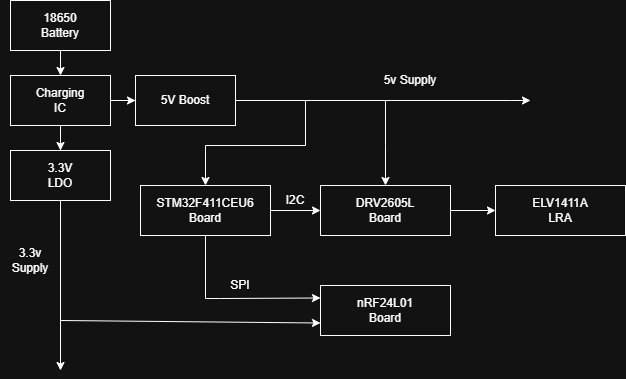

# Klaus
Wireless, wearable vibration-based metronome to help musicians stay in sync. Built with STM32CubeIDE and STM32CubeMX 
## Purpose / Background Info
I designed Klaus for my string quartet because we had trouble hearing the metronome. Metronomes are too quiet while playing, and visual cues are too subtle while reading. Klaus helped my quartet practice many pieces, and I hope it helps others too!
## Features
- Linear resonant actuator for strong click sensations
- Adjustable tempo via rotary encoder
- Wireless syncing with multiple devices
- Battery powered with charging
## Parts
- STM32F411CEU6 Blackpill Board
- 18650 Battery
- TP4056 Charging Breakout Board
- 5V Boost Converter
- AP2112K-3.3 LDO
- DRV2605L Haptic Breakout Board
- ELV1411A LRA
- nRF24L01+ - PA - LNA Board
- Decoupling capacitors (ceramic, electrolytic)
## How to make
- Clone repo
- Open in STM32CubeIDE
- Flash to STM32F411CEU6 Blackpill Board
- See block diagram for putting together
- Rotary encoder for adjusting tempo

# Design and Functionality

## Peripherals / Functionality
- I2C: DRV2605L
- SPI: nRF24L01+
- UART: serial adapter for debugging
- Timers: metronome, microsecond delay
- GPIO Interrupts: rotary encoder for tempo change
## Design choices
- ELV1411A: LRAs generate stronger "click" sensations for musicians
- RF module choice: PA and LNA enhance reliability in larger setups. May be important with metal music stands and chairs
- nRF24L01+ driver: Disabled auto-ack/retransmit to avoid collisions with multiple receivers. Only one pipe is needed for this project
- AP2112K-3.3: Has a high max current for supplying the PA + LNA demands of of the nRF. 
## Driver Information
DRV2605L Driver
- Initialization handle and configures DRV2605L
- Calibrates driver for ELV1411A, runs with DRV2605L waveforms

nRF24L01+ Driver
- Initializes NRF24L01 handle and configures device for transceiving
- Functions for entering TX and RX mode
- Function for handling transmits, and IRQs/Callback for receiving
- Does not use Auto-Ack or Auto-Retransmit. Currently only uses one pipe
## Personal achievements
- Use multimeter to build power circuits, diagnose faulty components
- Reference datasheets for custom I2C and SPI drivers
- Skills with I2C, SPI, UART, RF, Timers, Interrupts
- Familiarity with electrical noise
