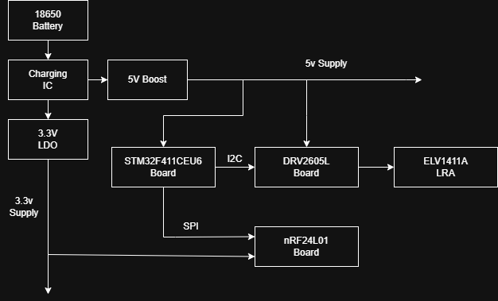

# Klaus
Wireless, wearable, vibration-based metronome to help musicians stay in sync. Built with STM32CubeIDE and STM32CubeMX 
## Purpose / Background Info
I designed Klaus for my string quartet because we had trouble hearing the metronome. Metronomes are too quiet while playing. Klaus helped my quartet practice many pieces, and I hope it helps others too!
## Features
- Linear resonant actuator for strong click sensations
- Adjustable tempo via rotary encoder
- Wireless syncing with multiple devices
- Battery powered, rechargeable
## Project Layout
- Klaus (Repo)
  - Klaus (Container folder)
    - Drivers
      - Custom: Header and source files for NRF24L01+, DRV2605L, and metronome code
    - Core
      - Src: Main.c here
## Parts
- STM32F411CEU6 Blackpill Board
- 18650 Battery (With protection circuit)
- TP4056 Charging Board
- 5V Boost Converter
- AP2112K-3.3 LDO (or, use a NRF24L01 adapter board. Takes 5V)
- DRV2605L Haptic Board
- ELV1411A LRA
- NRF24L01+ (With PA and LNA)
## How to Make
- Clone the repo, and open the Klaus container folder (inside this repo) in STM32CubeIDE
- Use an ST-Link (or other method) to flash the STM32F411CEU6
- View pin mapping by opening .ioc file in STM32CubeMX
- View block diagram below for help putting device together. (Note: diagram does not show rotary encoder or mode-switching button)
- Supply 5v to the STM32 5v pin, and the DRV2605L haptic board. Supply 3.3v to the NRF24L01+ board; or, use an NRF24L01 adapter board, which takes 5V. 

# Design and Functionality
Note: Block diagram does not show the rotary encoder or the button for mode switching.

## Peripherals / Functionality
- I2C: DRV2605L
- SPI: NRF24L01+
- UART: Serial debugging
- Timers: RF syncing and metronome beat generation, microsecond delay for driver initialization
- GPIO Interrupts: rotary encoder for tempo change, RF interrupt detection
## Design Choices / Tradeoffs
- ELV1411A: LRAs generate stronger "click" sensations for musicians
- PA + LNA version for the NRF may enhance reliability in larger setups.
- Disabled auto-ack/retransmit in the NRF driver to avoid collisions with multiple receivers.
- RF uses only one pipe, because only one is needed for this project
- DRV2605L driver specifically designed for setup with ELV1411A. Tradeoff for simplicity under time constraints
- AP2112K-3.3: Has a high max current for supplying the PA + LNA demands of of the NRF. Alternatively, an adapter board is much simpler to use.
